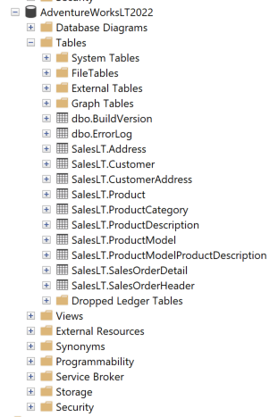
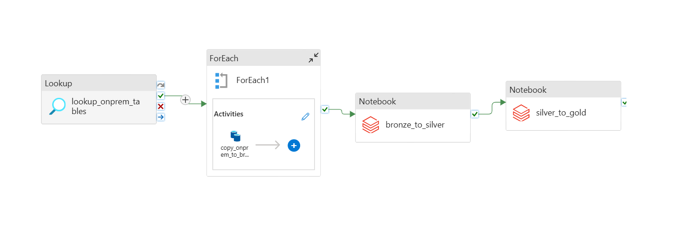
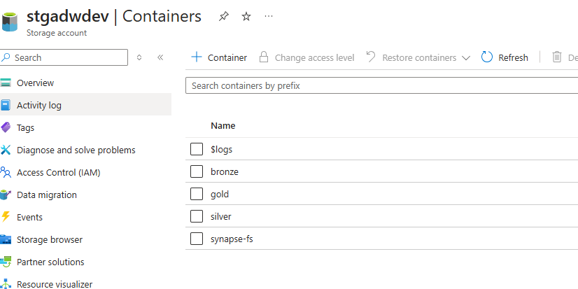
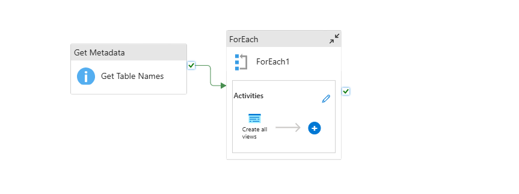

# AdventureWorks: On-Prem to Azure Cloud Migration

Migrating the AdventureWorks lightweight database from an on-premises SQL Server to the Azure cloud environment using a modern data engineering stack. This project simulates a real-world cloud migration process, leveraging Azure Data Factory, Data Lake, Databricks, Synapse Analytics, and Power BI for end-to-end data transformation and visualization.

## 🔍 End-to-End Data Flow
1️⃣ On-Prem SQL Database Simulation (Azure SQL Database) – Stores the raw AdventureWorks data \
2️⃣ Azure Data Factory (ADF) – Extracts and loads data into Data Lake \
3️⃣ Azure Data Lake Storage (ADLS) – Stores raw, transformed, and final data \
4️⃣ Azure Databricks – Data transformations (Bronze ➜ Silver ➜ Gold) \
5️⃣ Azure Synapse Analytics – Data warehousing and querying \
6️⃣ Power BI – Data visualization and reporting

## 🛠️ Tech Stack
✅ Azure SQL Database \
✅ Azure Data Factory \
✅ Azure Data Lake Storage \
✅ Azure Databricks \
✅ Azure Synapse Analytics \
✅ Power BI
## 🔄 Data Pipeline Process

#### 1️⃣ Data Extraction: SQL Server Database (On-Prem)
Extracted AdventureWorks tables from SQL Server into Azure Data Factory.\

#### 2️⃣ Azure Data Factory Pipeline Execution
Data Factory orchestrates the ETL process from SQL Server to Data Lake.\

#### 3️⃣ Data Storage: Azure Data Lake (Bronze Layer)
The extracted data is loaded into the Bronze Layer of Azure Data Lake.\

#### 4️⃣ Data Transformation: Databricks (Bronze ➜ Silver ➜ Gold)
Performed data cleaning and transformation using Spark & Databricks.\

#### 5️⃣ Data Warehousing: Synapse Analytics for Querying
Loaded the cleaned data into Synapse Analytics for reporting.\

#### 6️⃣ Data Visualization: Power BI Dashboard
Created an interactive dashboard using Power BI to gain insights from data.
## 🚀 Learning Outcomes
✅ Azure Data Factory pipeline orchestration \
✅ Data Lake architecture and management \
✅ Databricks for data transformation and Spark optimization \
✅ Building scalable data warehouses with Synapse Analytics \
✅ Power BI dashboard design and sharing \
✅ Implementing the Bronze-Silver-Gold architecture \
✅ Handling schema evolution and data quality
## 🌟 Future Scope
🚀 Implement CI/CD for Data Pipelines \
🚀 Explore Real-Time Streaming Data Ingestion
